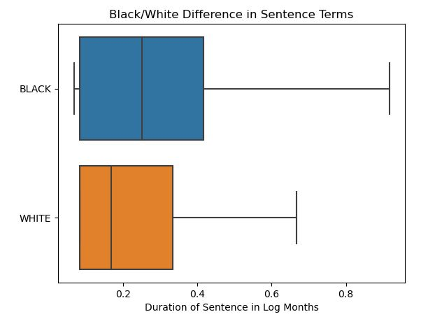
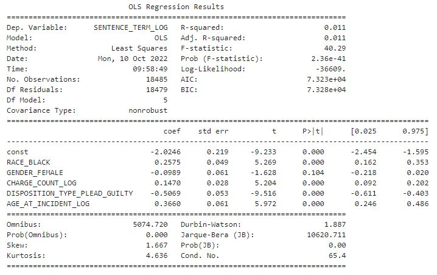

# Racially Biased Prison Sentencing

## Purpose
The purpose of this notebook is to evaluate using the simple OLS regression
model whether there is a relationship between the race of a criminal
defendant or not. This analysis was completed using data from Cook County
Illinois. [Link](https://catalog.data.gov/dataset/sentencing).

## Analysis
The analysis used the Ordinary Least Squares regression model to find a
relationship between the race of a criminal defendant sent to prison and their
sentence duration. The boxplot below shows that on average, Black defendants
spend more time in prison than White defendants, all else equal.

The final regression output summary, pictured below, details the relationship
between race and sentence length. We see that race is statistically
significant and that Black defendants are expected to serve about 25 percent
more time than White defendants.

